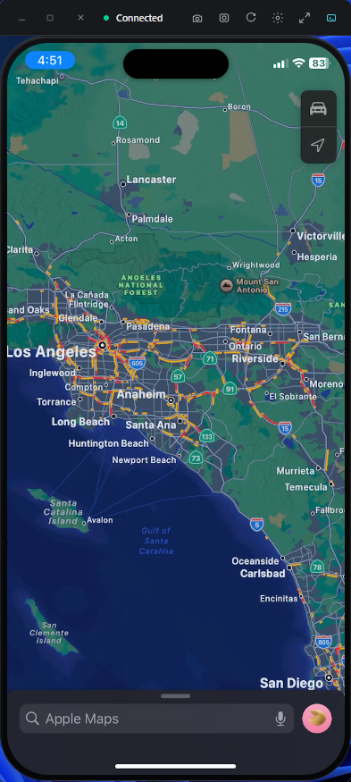
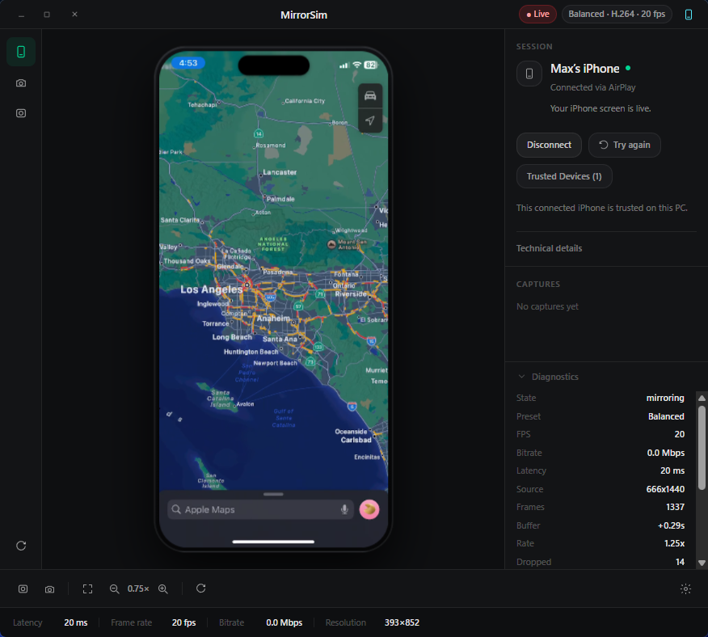
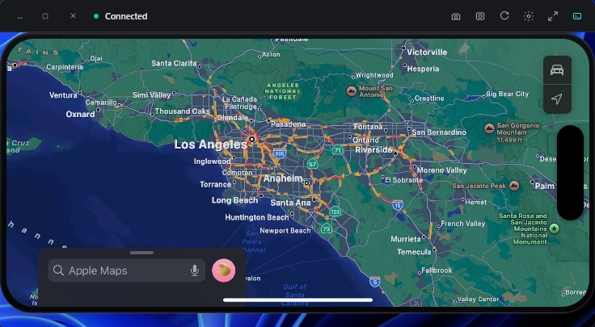

# MirrorSim

MirrorSim is a Windows app for mirroring an iPhone over AirPlay in a clean, presentation-ready device frame. It is built for demos, QA, product screenshots, app walkthroughs, and quick screen recordings without plugging in a cable.

It gives you a focused iPhone preview instead of a noisy receiver window: Minimal mode for floating over your desktop, Console mode for diagnostics and controls, screenshots, local recording, trusted-device handling, auto-rotation, and live preview tuning.

> MirrorSim includes a bundled AirPlay receiver runtime built from a fork of [AirPlayServer by xenos1337](https://github.com/xenos1337/AirPlayServer). MirrorSim provides the desktop app, UI, capture tools, diagnostics, and release packaging around that receiver layer.

<p align="center">
  
</p>

<details>
  <summary>Screenshots</summary>

  <p align="center">
    
  </p>

  <p align="center">
    
  </p>
</details>

---

## Highlights

- Live iPhone screen mirroring over Wi-Fi
- Minimal floating device-frame mode for demos and recordings
- Console mode with connection state, diagnostics, capture history, and controls
- Portrait and landscape framing with automatic orientation updates
- Screenshots to disk and/or clipboard
- Local `.webm` screen recordings from the preview surface
- Adjustable preview quality and live-edge catch-up presets
- Trusted-device preferences and receiver access controls
- Bonjour readiness checks and helpful troubleshooting actions

---

## Requirements

- Windows 10 or later, x64
- [Bonjour for Windows](https://support.apple.com/kb/DL999)
- iPhone and PC on the same Wi-Fi network
- Windows Firewall allowing MirrorSim on the network you are using

MirrorSim bundles its AirPlay receiver runtime in release builds. You do not need to install a separate receiver package.

---

## Install

### Unsigned beta builds

MirrorSim is currently shipping as an unsigned early beta while the project is still getting its first public releases out. Windows SmartScreen may warn on first launch.

To run the official GitHub release build:

1. Click **More info** on the SmartScreen warning.
2. Click **Run anyway**.

Only download MirrorSim from the official [GitHub Releases](https://github.com/Mahcks/MirrorSim/releases/latest) page. Release assets include SHA-256 checksums so you can verify the installer or portable zip before running it.

MirrorSim ships in two formats:

- **Installer**: best for most users. Installs MirrorSim like a normal desktop app.
- **Portable zip**: extract and run without a full install.

Download the latest release from:

```text
https://github.com/Mahcks/MirrorSim/releases/latest
```

### Installer

1. Download the latest MirrorSim installer.
2. Run the installer.
3. Install Bonjour for Windows if your iPhone cannot discover MirrorSim.
4. Launch MirrorSim from Start or the desktop shortcut.

### Portable

1. Download the latest portable zip.
2. Extract it to a folder you control.
3. Run `MirrorSim.exe`.
4. Install Bonjour for Windows if your iPhone cannot discover MirrorSim.

---

## Use MirrorSim

1. Launch MirrorSim.
2. Click **Start**.
3. On your iPhone, open Control Center.
4. Tap **Screen Mirroring**.
5. Choose the receiver name shown in MirrorSim, usually `MirrorSim`.
6. Approve the pairing/trust prompt if MirrorSim asks for it.

The live iPhone preview appears inside the device frame. Use Minimal mode when you want the clean floating overlay, or Console mode when you want diagnostics, settings, and capture history visible.

---

## Modes

**Minimal mode** is the showcase view: just the device frame, a compact title bar, and quick controls for capture, recording, rotation, preferences, and switching back to Console.

**Console mode** is the control room: connection status, Bonjour state, diagnostics, capture history, recording controls, trusted devices, and troubleshooting tools.

---

## Captures

By default, captures are saved under:

```text
Pictures/MirrorSim/
```

Default filenames:

- Screenshots: `mirrorsim_screenshot_YYYYMMDD_HHMMSS.png`
- Recordings: `mirrorsim_recording_YYYYMMDD_HHMMSS.webm`

Preferences let you choose whether screenshots save to disk, copy to clipboard, or both. You can also change the screenshot and recording folders.

---

## Keyboard Shortcuts

| Shortcut | Action |
| --- | --- |
| `Ctrl+S` | Take screenshot |
| `Ctrl+R` | Toggle recording |
| `Ctrl+F` or `F` | Toggle fullscreen |
| `Ctrl+M` | Toggle Console/Minimal mode |
| Double-click the device | Toggle fullscreen |
| `F1` | Toggle diagnostics, switching to Console mode if needed |
| `H` | Hide or show the Minimal mode toolbar |
| `Esc` | Close Preferences or the context menu |

---

## Preview Presets

Preview presets tune the desktop playback surface. They do not change the iPhone's AirPlay stream quality directly; they adjust scaling and how aggressively MirrorSim catches up to the live edge after small stalls or sleep/wake hiccups.

| Preset | Best for | Behavior |
| --- | --- | --- |
| Good quality | Demos and review | Smooth scaling with a slightly steadier preview |
| Balanced | Everyday use | A practical balance between clarity and latency |
| Fast speed | Lowest latency | More aggressive live-edge catch-up and pixelated scaling |

---

## Current Limitations

MirrorSim is focused on screen mirroring.

- **System audio capture/playback is not currently included. It's actively being worked on**
- DRM-protected video playback is not supported.
- AirPlay discovery depends on Bonjour and local network/firewall conditions.
- Sleep/wake and reconnect behavior depends partly on how iOS resumes the AirPlay sender session.

---

## Troubleshooting

### iPhone does not see MirrorSim

- Install Bonjour for Windows.
- Make sure the Bonjour Service is running.
- Put the iPhone and PC on the same Wi-Fi network.
- Allow MirrorSim through Windows Firewall on private networks.
- Avoid VPNs, proxies, or VM/NAT networking while testing discovery.

MirrorSim can show Bonjour status in-app and can open the Bonjour download, Windows Services, and Windows Firewall pages for you.

### Session connects but stays blank or gets delayed

- Open Console mode and expand diagnostics.
- Watch `Buffer`, `Rate`, `Dropped`, `Queued`, `Init`, `Appended`, and `Last error`.
- Try the **Fast speed** preset for lower latency.
- Disconnect and reconnect the iPhone from Control Center if iOS resumes from sleep in a bad state.
- Restart MirrorSim if the native receiver runtime has been left running from an older dev build.

### Screenshots or recording are not available

The preview must be live and decodable before capture works. If MirrorSim says the live preview is not ready, wait for the iPhone frame to appear or reconnect the session.

---

## Development

Install dependencies:

```powershell
bun install
```

Run the frontend only:

```powershell
bun run dev
```

Run the Tauri desktop app:

```powershell
bun run tauri dev
```

Build the frontend:

```powershell
bun run build
```

Run Rust tests:

```powershell
cargo test --manifest-path src-tauri\Cargo.toml
```

### AirPlay Runtime

MirrorSim expects the receiver runtime under:

```text
receivers/AirPlayServer/
```

Use the published runtime bundle:

```powershell
bun run fetch:airplay-runtime
```

Use a local sibling AirPlayServer build:

```powershell
bun run sync:airplay-runtime
```

`sync:airplay-runtime` looks for a sibling checkout at `..\AirPlayServer` and copies the built `MirrorSimAdapter.exe` plus required DLLs into MirrorSim.

Important: commands ending in `:fetch` download the runtime declared in `receivers/runtime-manifest.json`. Use those when you want to validate the published runtime. Do not use `:fetch` when you are trying to test local changes in the sibling AirPlayServer fork.

---

## Release Builds

Release packaging is driven by `scripts/build-release.ps1`.

```powershell
bun run release:prep
bun run release:installer
bun run release:portable
bun run release:all
```

Published-runtime variants:

```powershell
bun run release:prep:fetch
bun run release:installer:fetch
bun run release:portable:fetch
bun run release:all:fetch
```

Release packaging uses Rust `1.88.0-x86_64-pc-windows-msvc` through the release script and CI. Normal local development can use your installed stable Rust toolchain.

Updater-enabled release builds require:

- `TAURI_SIGNING_PRIVATE_KEY`
- `TAURI_SIGNING_PRIVATE_KEY_PASSWORD`, if your key has a password

The GitHub release workflow expects `receivers/runtime-manifest.json` to point at a downloadable AirPlay runtime zip with a matching SHA-256 checksum. The workflow also publishes `release/latest.json` for Tauri updater checks.

The first public release line is `v0.1.0-beta.x`. Use a tag like:

```powershell
git tag v0.1.0-beta.1
git push origin v0.1.0-beta.1
```

The release workflow uploads installer, portable zip, updater metadata, and `checksums.txt`.

---

## Tech Stack

- Tauri 2
- Rust
- React
- TypeScript
- Tailwind CSS
- Bundled native AirPlay receiver runtime

---

## Credits

MirrorSim depends on work from the AirPlay reverse-engineering and open-source desktop media communities.

- [AirPlayServer](https://github.com/xenos1337/AirPlayServer) by xenos1337
- [airplay2-win](https://github.com/fingergit/airplay2-win) by fingergit
- Bonjour, FFmpeg, SDL2, and related libraries used by the bundled receiver runtime

MirrorSim itself is licensed under MIT. The bundled AirPlay receiver runtime includes separate third-party license terms in `LICENSES/AirPlayServer-LICENSE`.

Apple, AirPlay, and iPhone are trademarks of Apple Inc. MirrorSim is an independent project and is not affiliated with or endorsed by Apple Inc.
