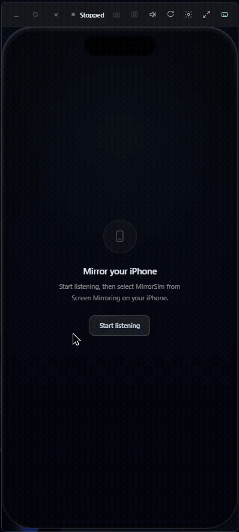

# MirrorSim

[](https://github.com/Mahcks/MirrorSim/releases/latest)
[](https://github.com/Mahcks/MirrorSim/actions)
[](LICENSE)
[](https://github.com/Mahcks/MirrorSim/releases/latest)


MirrorSim mirrors an iPhone over AirPlay into a clean, presentation-ready device-frame window on Windows — no cable, no clutter, no generic receiver UI in your screenshots. Point your iPhone at it from Control Center and you get a focused, floating device frame ready for demos, QA, screen recordings, and walkthroughs.

<p align="center">
  
</p>

<p align="center">
  <a href="https://github.com/Mahcks/MirrorSim/releases/latest"></a>
  <a href="https://github.com/Mahcks/MirrorSim/releases/latest"></a>
</p>

> MirrorSim includes a bundled AirPlay receiver runtime built from a fork of [AirPlayServer by xenos1337](https://github.com/xenos1337/AirPlayServer). MirrorSim provides the desktop app, UI, capture tools, diagnostics, and release packaging around that receiver layer.

<details>
  <summary>Screenshots</summary>

  <p align="center">
    
  </p>

  <p align="center">
    
  </p>
</details>

---

## Why MirrorSim

Screen mirroring an iPhone on Windows usually means QuickTime on a Mac you don't have, a cable, or a generic receiver window full of chrome you have to crop out later. MirrorSim is built specifically for people who need a clean, reliable, real-hardware mirror of an iPhone on a Windows machine:

- **QA and bug repro on real hardware** — reproduce and capture issues on an actual iPhone, not a simulator, with diagnostics (buffer, rate, dropped/queued frames, last error) visible right in Console mode.
- **Product and marketing screenshots** — a clean device frame with no receiver chrome, ready to drop straight into a deck, store listing, or blog post.
- **App walkthroughs and tutorials** — record `.webm` walkthroughs of your app running on real iOS, not an emulator skin.
- **Live client and stakeholder demos** — Minimal mode gives you a floating, presentation-ready overlay you can screen-share without exposing the rest of your desktop.
- **Conference and presentation mirroring** — mirror to the room without a Lightning-to-HDMI dongle or a cable snaking to the podium.
- **Remote support and pairing sessions** — see exactly what a teammate or user sees on their device in real time, over Wi-Fi.
- **Content creation** — capture iPhone app footage for videos, tutorials, or social content directly to disk.

---

## Highlights

- Live iPhone screen mirroring over Wi-Fi
- Minimal floating device-frame mode for demos and recordings
- Console mode with connection state, diagnostics, capture history, and controls
- Receiver-driven portrait and landscape framing with a manual override that is not fooled by apps publishing a separate landscape video surface
- Screenshots to disk and/or clipboard, with an optional presentation-ready device frame
- Local `.webm` screen recordings with iPhone audio and an optional device frame
- Adjustable preview quality and live-edge catch-up presets
- Trusted-device preferences and receiver access controls
- Built-in mDNS discovery that follows active network interfaces without requiring Bonjour for Windows

---

## Requirements

- Windows 10 or later, x64
- iPhone and PC on the same Wi-Fi network
- Windows Firewall allowing MirrorSim on the network you are using

MirrorSim bundles its AirPlay receiver runtime in release builds. You do not need to install a separate receiver package.

---

## Install

### Unsigned beta builds

MirrorSim is currently shipping as an unsigned early beta while the project is still getting its first public releases out. Windows SmartScreen may warn on first launch.

To run the official GitHub release build:

1. Click **More info** on the SmartScreen warning.
2. Click **Run anyway**.

Only download MirrorSim from the official [GitHub Releases](https://github.com/Mahcks/MirrorSim/releases/latest) page. Release assets include SHA-256 checksums (`checksums.txt`) so you can verify the installer or portable zip before running it.

MirrorSim ships in two formats:

- **Installer**: best for most users. Installs MirrorSim like a normal desktop app.
- **Portable zip**: extract and run without a full install.

### Installer

1. Download the latest MirrorSim installer from [GitHub Releases](https://github.com/Mahcks/MirrorSim/releases/latest).
2. Run the installer.
3. Launch MirrorSim from Start or the desktop shortcut.

### Portable

1. Download the latest portable zip from [GitHub Releases](https://github.com/Mahcks/MirrorSim/releases/latest).
2. Extract it to a folder you control.
3. Run `MirrorSim.exe`.

---

## Use MirrorSim

1. Launch MirrorSim.
2. Click **Start listening**.
3. On your iPhone, open Control Center.
4. Tap **Screen Mirroring**.
5. Choose the receiver name shown in MirrorSim, usually `MirrorSim`.
6. Approve the pairing/trust prompt if MirrorSim asks for it.

The live iPhone preview appears inside the device frame. Use Minimal mode when you want the clean floating overlay, or Console mode when you want diagnostics, settings, and capture history visible.

---

## Modes

**Minimal mode** is the showcase view: just the device frame, a compact title bar, and quick controls for capture, recording, audio, rotation, preferences, and switching back to Console.

**Console mode** is the control room: connection and discovery state, diagnostics, capture history, recording controls, trusted devices, and troubleshooting tools.

---

## Captures

By default, captures are saved under:

```text
Pictures/MirrorSim/
```

Default filenames:

- Screenshots: `mirrorsim_screenshot_YYYYMMDD_HHMMSS.png`
- Recordings: `mirrorsim_recording_YYYYMMDD_HHMMSS.webm`

Preferences let you choose whether screenshots save to disk, copy to clipboard, or both. You can also change the screenshot and recording folders and independently include the device frame in each export type. The Audio section can follow the iPhone volume buttons, apply a separate MirrorSim master level, switch to mono compatibility, and include or omit full-level iPhone audio in new recordings. Playback controls never change Windows system volume or reduce recorded audio.

---

## Keyboard Shortcuts

| Shortcut | Action |
| --- | --- |
| `Ctrl+S` | Take screenshot |
| `Ctrl+R` | Toggle recording |
| `Ctrl+F` or `F` | Toggle fullscreen |
| `Ctrl+M` | Toggle Console/Minimal mode |
| Double-click the device | Toggle fullscreen |
| `F1` | Toggle diagnostics, switching to Console mode if needed |
| `H` | Hide or show the Minimal mode toolbar |
| `Esc` | Close the active dialog or context menu, or leave fullscreen |

---

## Preview Presets

Preview presets tune the desktop playback surface. They do not change the iPhone's AirPlay stream quality directly; they adjust scaling and how aggressively MirrorSim catches up to the live edge after small stalls or sleep/wake hiccups.

| Preset | Best for | Behavior |
| --- | --- | --- |
| Good quality | Demos and review | Smooth scaling with a slightly steadier preview |
| Balanced | Everyday use | A practical balance between clarity and latency |
| Fast speed | Lowest latency | More aggressive live-edge catch-up and pixelated scaling |

---

## Current Limitations

MirrorSim is focused on screen mirroring.

- Apple DRM-protected video cannot be decrypted because iOS replaces protected pixels before they reach the receiver; unprotected player controls and audio may continue normally. MirrorSim separately reports an explicit sender-paused picture, and only suggests protected playback after multiple advancing, uniformly near-black frames arrive with audible audio. This is deliberately conservative because AirPlay exposes no trustworthy per-title DRM flag. Return to normal Screen Mirroring or use the streaming service's Windows app for protected playback.
- Automatic rotation requires the bundled protocol `0.8.0` receiver. MirrorSim follows the reported source-screen shape while ignoring separate media-output dimensions, and Rotate remains available as a temporary override.
- Built-in mDNS removes the Bonjour dependency and follows interface changes, but guest Wi-Fi isolation, VPNs, and Windows Firewall rules can still block local AirPlay traffic.
- MirrorSim preserves ordinary interrupted mirror-data sessions for up to two minutes. An explicitly paused sender remains available while iOS keeps the AirPlay control session alive, but iOS can still terminate that session during longer sleep or network changes.

---

## Troubleshooting

### iPhone does not see MirrorSim

- Put the iPhone and PC on the same Wi-Fi network.
- Allow MirrorSim through Windows Firewall on private networks.
- Avoid VPNs, proxies, or VM/NAT networking while testing discovery.
- In Preferences > Connection, use **Refresh discovery** after changing Wi-Fi or firewall settings.

MirrorSim advertises AirPlay directly with its built-in mDNS service and can open Windows Firewall settings for you.

### Session connects but stays blank or gets delayed

- Open Console mode and expand diagnostics.
- Watch `Buffer`, `Rate`, `Dropped`, `Queued`, `Init`, `Appended`, and `Last error`.
- Try the **Fast speed** preset for lower latency.
- Disconnect and reconnect the iPhone from Control Center if iOS resumes from sleep in a bad state.
- Restart MirrorSim if the native receiver runtime has been left running from an older dev build.

### Screenshots or recording are not available

The preview must be live and decodable before capture works. If MirrorSim says the live preview is not ready, wait for the iPhone frame to appear or reconnect the session.

### iPhone audio is silent

- Make sure MirrorSim is not muted and its master volume is above zero.
- If **Follow iPhone volume** is enabled, raise the volume on the iPhone.
- Select the speaker control once if Windows has paused audio playback until you interact with the app.

---

## Tech Stack

Tauri 2, Rust, React, TypeScript, Tailwind CSS, and a bundled native AirPlay receiver runtime.

---

## Contributing

Want to build MirrorSim from source, work on a fix, or cut a release? See [CONTRIBUTING.md](CONTRIBUTING.md) for local dev setup, the AirPlay runtime workflow, and release/build instructions.

For support and project policies:

- Use the [bug report form](https://github.com/Mahcks/MirrorSim/issues/new?template=bug-report.yml) for reproducible problems and attach a reviewed diagnostics export when it is safe to share.
- Use the [feature request form](https://github.com/Mahcks/MirrorSim/issues/new?template=feature-request.yml) for proposed improvements and new workflows.
- Read the [privacy statement](PRIVACY.md) for details about local media processing, network activity, diagnostics, and retained application data.
- Follow the [security policy](SECURITY.md) to report suspected vulnerabilities privately.

---

## Credits

MirrorSim depends on work from the AirPlay reverse-engineering and open-source desktop media communities.

- [AirPlayServer](https://github.com/xenos1337/AirPlayServer) by xenos1337
- [airplay2-win](https://github.com/fingergit/airplay2-win) by fingergit
- mDNS discovery, FFmpeg, SDL2, and related libraries used by the bundled receiver runtime

MirrorSim itself is licensed under MIT. The bundled AirPlay receiver runtime includes separate terms and source links documented in [`THIRD_PARTY_NOTICES.md`](THIRD_PARTY_NOTICES.md) and `LICENSES/`.

Apple, AirPlay, and iPhone are trademarks of Apple Inc. MirrorSim is an independent project and is not affiliated with or endorsed by Apple Inc.
